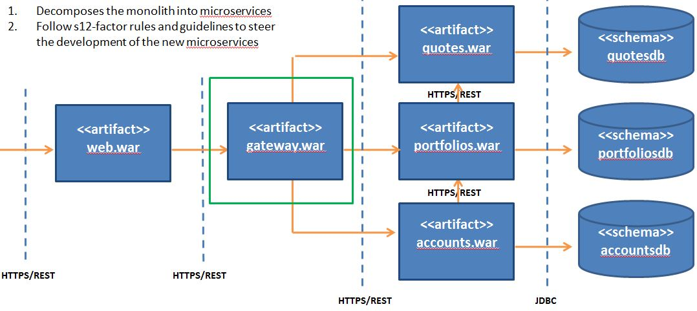

# Gateway Microservice

	The API gateway from the Web UI to the microservices

## Current State Architecture

DayTrader is multi-tier application built around the paradigm of an online stock trading system. Example business functions include
login, register, view portfolio, lookup stock quotes, and buy or sell stock. DayTrader was originally developed by IBM and donated 
to the Apache Geronimo community in the 2005 timeframe. The DayTrader architecture is representitive of monolithic applications that 
many businesses are still using. For that reason, we selected it to clarify the techniques for refactoring a monolith to microservices. 
For the original monolithic architecture, see http://geronimo.apache.org/GMOxDOC30/daytrader-a-more-complex-application.html. 

## Target State Architecture

### Gateway Application

The Gateway Application (highlighted in the green box) is a Spring Boot Application that is responsible for delegating business functions to the appropriate microservices API

#### Static Viewpoint

#### Dynamic Viewpoint

#### Participant and Responsibilities

## Prerequisites

		1.	Java Development Kit (64 bit) 1.8+
		2.	Apache Maven 3.3.9+

## Delivery Pipeline

### Build Automation

		1.	cd daytrader-gatewayapp
		2.	mvn clean install

### Integration Test

	Running the integration test is done in three phases: pre-integration-test, integration-test, and post-integration-test

#### Phase 1: pre-integration-test

		1.	Start Accounts

			a.	cd daytrader-accountsapp\daytrader-accounts
			b.	env\external\bin\start_server.bat

		2.	Start Portfolios

			a.	cd daytrader-portfoliosapp\daytrader-portfolios
			b.	env\external\bin\start_server.bat

		3. Start Quotes

			a.	cd daytrader-quotesapp\daytrader-quotes
			b.	env\external\bin\start_server.bat

#### Phase 2: integration-test

		1.	Gateway

			a.	cd daytrader-gatewayapp
			b.	mvn -Pci clean install

#### Phase 3: post-integration-test

		1.	Stop Accounts

			a.	cd daytrader-accountsapp\daytrader-accounts
			b.	env\external\bin\stop_server

		2.	Stop Portfolios

			a.	cd daytrader-portfoliosapp\daytrader-portfolios
			b.	env\external\bin\stop_server

		3.	Stop Quotes

			a.	cd daytrader-quotesapp\daytrader-quotes
			b.	env\external\bin\stop_server

## API Endpoints 

### Swagger UI Documentation

	To see the API documentation, 

		1. Start the application

			a.	cd daytrader-gatewayapp
			b. 	daytrader-gateway\env\external\bin\start_server

		2. 	Point you browser to https://localhost:2443/swagger-ui.html

		3.	Stop the application after reviewing the API documentation

			a.	cd daytrader-gatewayapp	
			b.	daytrader-gateway\env\external\bin\stop_server

	